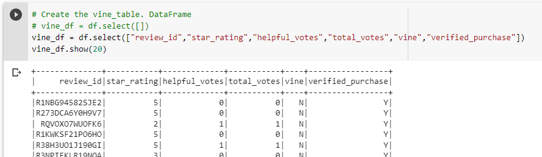
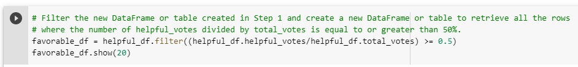

# Amazon_Vine_analysis
An analysis was performed on a set of amazon review data to determine if there is a bias between customers who were subscribers to a Vine Program vs non-subscribers.

## Overview of Analysis
The analysis of data in this project required that we select a dataset from a list of dataset that was provided. I chose the dataset that included [Amazon Camera Reviews](https://s3.amazonaws.com/amazon-reviews-pds/tsv/amazon_reviews_us_Camera_v1_00.tsv.gz).

From the dataset, a subset was extracted that include 'Review ID', 'Star Rating', 'Helpful Votes', 'Total Votes', 'Vine', 'Verified Purchase' columns as vine_df, a DataFrame. The DataFrame was inspected for data type to make sure that they were compatible to use in the analysis.

The data was then filtered for reviews that receive more than 20 total votes AND greater than equal to 50% of favorable votes.

The dataset was then divided again using a filter method into two separate dataset paid and unpaid (paid = vine subscribers and unpaid = non-subscribers) for analysis.

The percentage of five-star votes were calculated for both the paid and unpaid subscriber groups.

## Results
As we investigate the five-start rated counts for the paid and unpaid subscribers, it is seen that 42.4% (246 of 580) paid subscribers and 50.0% (23837 of 47703) unpaid subscribers voted with a five-star rating.

## Summary
As seen in the results, the paid to unpaid percent five-star ratings (42.4% to 50.0%) show a bias towards the unpaid subscribers who are likely to provide a five-star rating. Which shows a negative biased revies in the Vine Program.